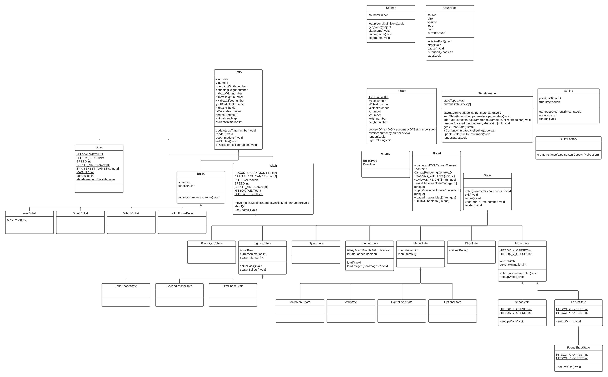
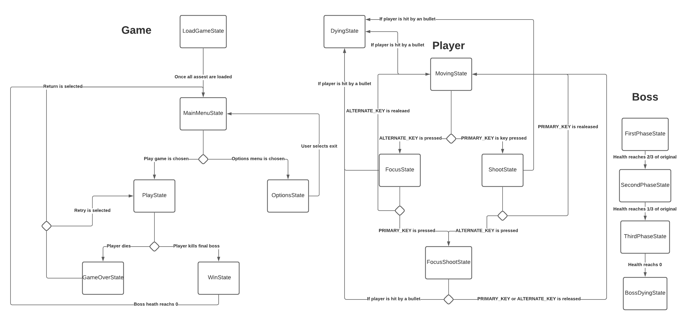
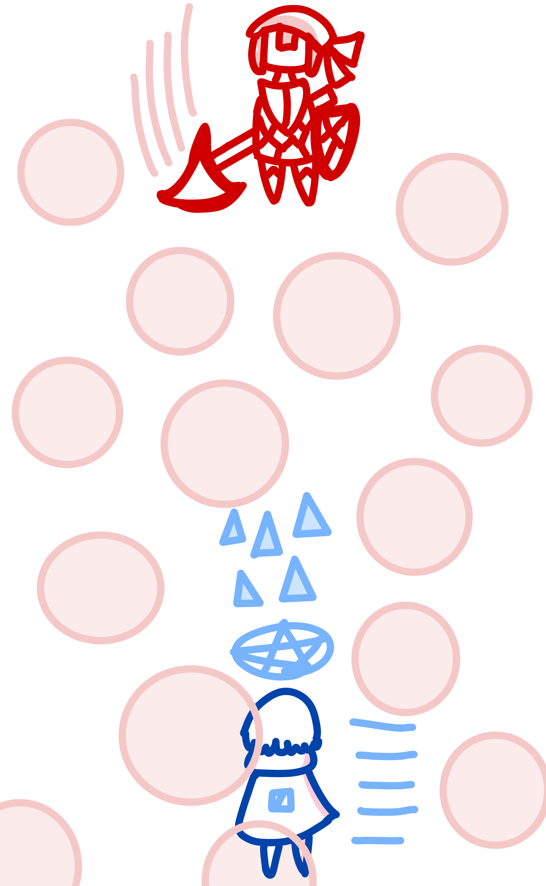

# Behind

## Description
Behind is a short bullet hell shooter developed using javascript for the canvas where the player puppets a witch fighting a boss with multiple phases. 
The boss enemy is the win and lose state of the game (if you get shot you lose, if you shoot them enough without getting shot yourself you win). 

## Gameplay
The witch can move, shoot and focus being able to combine these actions to change their affect 

> for example if we just shoot we lauch a chain of large fireballs but when we shoot while focused or focus while shooting our projectiles 
type changes into a chain of quick precise lighting bolts. 

Focusing also shows off the other unique property of the witch, the hitbox. When not focusing the witch will not display their actual hitbox which is far smaller
then how their body makes it look. This is a stapple in bullet hell shooters and allows for more large and complex bullet paterns while keeping the details
of a larger sprite/model. The player can 'Graze' between shots by having a shot look like it hits them without actally hitting their hitbox.

The boss will be able to be shot by the player, losing health when the witch hits them. When a threshold is reached the boss will change 'Phase' which will determine 
how the attempt to harm the player (IE what bullets they will shoot). When the player is hit by a boss projectile they will lose the game and game over. The 'Phases' 
will increase in toughness with a minimum of 3 phases being implemented in the end product. 

The game starts in the loading state changing to main menu state when finished loading. The player can select to start or options in main state. 
Options allows the player to switch keybinds and play starts the game which is described above. When the player wins they move to a win screen and when
the player loses they move to the lose state where they are propted to retry or move to the main menu.

As you should have noticed the conrtol schemes are varriable and change depending on the inputs decided by the player. 

## Requirements
1. The user should be able to select between 'options' and 'play' on the main menu and move to the correct state accordingly.
2. The user should be able to select between 'retry' and 'return to main menu' on the game over screen and move to the correct state accordingly.
3. The user should be moved to the main menu when selecting the 'return to main menu' in win menu.
4. The user can change the accepted inputed keys for the different controls like primary key or alternate key.
5. The user when controlling the witch they can move the witch.
6. The user when controlling the witch can shoot projectiles when unfocused.
7. The user when controlling the witch can focus.
8. The user when controlling the witch can shoot a different type of projectiles when focused.
9. The system shall load required files in the load state before entering the main menu state for the first time.
10. If the witch is hit by the boss's bullet the system enters the game over state.
11. If the witch hits the boss the boss's health decreases
12. The boss has different states that are changes when reaching a certain percentage (%) of health
13. When the boss reachs 0 health the game is set to win menu state.

## UML Class Diagram
>Made by Kevin Rumbolt

## State Diagram
>Made by Kevin Rumbolt

## Concept Art (Wireframes)
>Made by Tyler Messina-Katunar

## Assets
In terms of assets, sprites homegrown (we will make them ourselves) using programs like [Krita](https://krita.org/en/) 
and [Pixelart](https://www.pixilart.com/draw). Sounds will be produced on site and music will be taken from open source cites when
implemented . We will use Arial as a font to keep it simple to read. The UML and state diagrams were made using LucidCharts.
### GUI
The gui should be bare-bones and unintrusive so the user doensn't get distracted from being killed in one hit. It can be really hard to focus in environments 
with tons of colors and sound so the UI should be unintrusive with a basic clear color scheme.

## Other

### Extrenal Libraries
>Note that these will change as development progresses

1. [lodash.clonedeep](https://www.npmjs.com/package/lodash.clonedeep)
2. [dom-confetti](https://github.com/daniel-lundin/dom-confetti) 
3. some base code from [Vikram Signh](https://github.com/VikramSinghMTL) that was edited to suit the project.

### Unique Inclusions
ESinstall will be used so to complile node libraries into a single javascript file so that it can run without a server being active.

### Interesting Algorithms
>Note that these will change as development progresses

1. State Manager, a state machine using pushdown automata combined with heigharchy to allow not only a state history but the use of states in a far more addaptable method.
2. InputConverted and Commands, allows for the easy access of actions through any keyboard inputs anywhere in the code so that keys can be changed anytime and still work.
